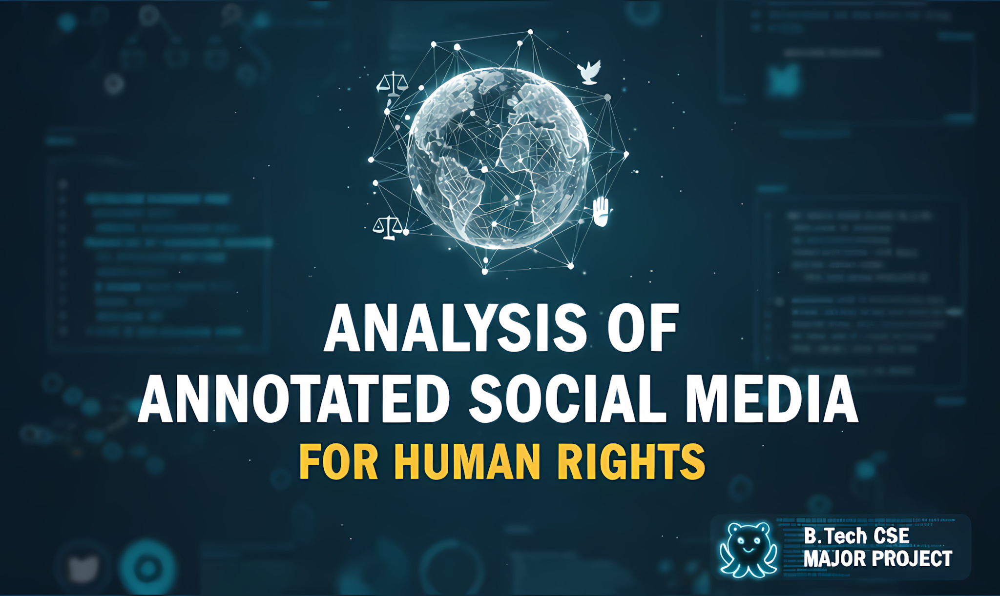

# Major Grp51
###### Active Repository for Major Project of Group 51 (2025–2026)



## Ethical Analysis of Human Rights Violations on Social Media

This project develops a structured framework for **identifying, annotating, and analyzing human rights violations (HRV)** reported on social media. Since official records are often delayed, censored, or inaccessible, digital accounts can serve as early indicators — but they are fragmentary, culturally constrained, and prone to misinformation.

The pipeline covers the full lifecycle:

1. **Data collection** — fetching posts from Telegram channels
2. **Translation** — converting posts to English for uniform annotation
3. **Annotation** — labelling posts via a Gradio web UI, building JSONL fine-tune datasets
4. **Fine-tuning** — training three LLMs (Mistral 7B, Llama 3.1, OpenHermes) on the HRV classification task using LoRA + Focal Loss on Kaggle GPUs

---

## Project Structure

```
Major_Grp51/
├── main.py                        ← Unified launcher (interactive menu + CLI)
├── pyproject.toml                 ← Project metadata & pip dependencies
│
├── src/
│   └── annotation.py              ← Unified annotation pipeline (imports from data/ & Annotation/)
│
├── data/
│   ├── tele_fetch.py              ← Fetch Telegram post texts → CSV
│   ├── annotate_yes.py            ← Build YES fine-tune JSONL; owns shared constants
│   ├── annotate_no.py             ← Build NO fine-tune JSONL
│   ├── Shuffle.py                 ← Shuffle JSONL files for reproducibility
│   ├── id_management.ipynb        ← Telegram channel ID exploration notebook
│   ├── tele_id_name.py            ← Resolve Telegram channel names from IDs
│   ├── tele_ids.py                ← Hardcoded Telegram channel ID lists
│   └── csv/                       ← Raw & annotated CSV exports
│
├── Annotation/
│   ├── app.py                     ← Gradio annotation web UI
│   └── Csv/                       ← CSVs being annotated (e.g. hrv_train_venezuela.csv)
│
├── llm/
│   ├── finetuning_llama31_instruct.py     ← Fine-tune Llama 3.1 8B Instruct
│   ├── finetuning_mistral_instruct.py     ← Fine-tune Mistral 7B Instruct v0.3
│   └── finetuning_openhermes_mistral.py   ← Fine-tune OpenHermes-2.5-Mistral-7B
│
├── translate/
│   ├── google.py                  ← Translate CSV posts via Google Cloud Translate
│   ├── libretranslate.py          ← Translate via self-hosted LibreTranslate server
│   └── argostranslate.py          ← Install offline Argos Translate language models
│
└── Papers/                        ← Reference papers and academic resources
```

---

## File-by-File Reference

### `main.py` — Pipeline Launcher

The single entry point for the entire project. Run it with no arguments for an **interactive numbered menu**, or pass sub-commands for scripted use.

```bash
# Interactive mode (shows menus)
python main.py

# Non-interactive: launch Gradio annotation app
python main.py annotation --cmd app

# Non-interactive: fine-tune Mistral on the Iran dataset
python main.py llm --script mistral --dataset iran
```

**Pipelines available:**

| Pipeline | Description |
|---|---|
| `annotation` | Launches `src/annotation.py` with a chosen sub-command |
| `llm` | Runs one of the three `llm/` fine-tuning scripts |

---

### `src/annotation.py` — Unified Annotation Orchestrator

A thin orchestrator that imports from all the individual modules in `data/` and `Annotation/` and exposes them through a single CLI. No business logic lives here.

```bash
# Launch Gradio annotation app
python src/annotation.py app [--csv path/to/file.csv] [--port 7860] [--share]

# Fetch Telegram posts into a CSV
python src/annotation.py fetch --input posts.csv --output fetched.csv \
    --username <tg_user> --api-id <id> --api-hash <hash>

# Build YES fine-tune JSONL from HRV-positive annotated CSV
python src/annotation.py yes --input hrv_yes.csv --output hrv_yes.jsonl

# Build NO fine-tune JSONL from HRV-negative annotated CSV
python src/annotation.py no --input hrv_no.csv --output hrv_no.jsonl

# Shuffle one or more JSONL files in-place (reproducible, seed=42)
python src/annotation.py shuffle --files hrv_train.jsonl hrv_test.jsonl
```

---

### `data/` — Data Collection & Dataset Building

#### `data/tele_fetch.py`
Connects to Telegram via the [Telethon](https://docs.telethon.dev) library and fetches post text for a list of `(Channel ID, Post ID)` pairs read from a CSV. Saves results with a `Post` column to an output CSV.

```bash
python data/tele_fetch.py --input ids.csv --output fetched.csv \
    --username me --api-id 123456 --api-hash abcdef
```

#### `data/annotate_yes.py`
Converts a CSV of **HRV-positive** annotated posts (columns: `Post`, `Trans`, `Type`) into an Alpaca-style JSONL fine-tuning dataset. Each row produces two JSONL entries — one for the original-language post and one for the English translation.

Owns the shared constants **`INSTRUCTION_TEXT`** and **`TYPE_MAP`** (the 4-category + combination violation type descriptions imported by `annotate_no.py`).

```bash
python data/annotate_yes.py --input hrv_yes.csv --output hrv_yes.jsonl
```

#### `data/annotate_no.py`
Converts a CSV of **HRV-negative** posts into JSONL, emitting a standard "no violation found" response for each post. Imports `INSTRUCTION_TEXT` from `annotate_yes.py` to avoid duplication.

```bash
python data/annotate_no.py --input hrv_no.csv --output hrv_no.jsonl
```

#### `data/Shuffle.py`
Reads a JSONL file, shuffles its rows with a fixed random seed (default `42`), and writes the result back.

```bash
python data/Shuffle.py --files hrv_train.jsonl hrv_test.jsonl hrv_val.jsonl
```

#### `data/tele_ids.py`
Hardcoded lists of Telegram channel IDs grouped by country/topic used for data collection.

#### `data/tele_id_name.py`
Resolves human-readable channel names from numeric Telegram channel IDs.

#### `data/id_management.ipynb`
Jupyter notebook for interactive Telegram channel/post ID exploration and management.

---

### `Annotation/app.py` — Gradio Annotation Web App

A web interface for labelling posts one by one. Loads a CSV, finds the first unannotated row, and lets the annotator:

- Mark each post as **Yes / No** (HRV or not)
- Select one or more **violation types** (A–D)
- Edit or confirm the **English translation**
- View live **dataset statistics** (total, annotated, remaining, type distribution)

Progress is saved to the CSV after every annotation.

```bash
# Run standalone
python Annotation/app.py

# Or via the unified launcher
python src/annotation.py app --csv Annotation/Csv/hrv_train_venezuela.csv --port 7860
```

**Violation categories:**

| Code | Category |
|---|---|
| A | Killing or injury of civilians |
| B | Destruction of civilian objects (homes, hospitals, schools, markets) |
| C | Rape, torture, or execution |
| D | Mistreatment or torture of prisoners / detainees |

---

### `llm/` — LLM Fine-Tuning Scripts

All three scripts are designed for **Kaggle notebooks** (P100 16 GB GPU). They share the same architecture:

- **4-bit quantization** (bitsandbytes NF4) for memory efficiency
- **LoRA** fine-tuning on attention layers (`q_proj`, `k_proj`, `v_proj`, `o_proj`)
- **Focal Loss** to address Yes/No class imbalance
- **Assistant-only masking** — loss computed only on model responses, not prompts
- Automatic checkpoint resumption

Each script now accepts a `--dataset` argument to select which regional dataset to train on:

| `--dataset` | Train file | Test file |
|---|---|---|
| `combined` *(default)* | `src/hrv_train.jsonl` | `src/hrv_test.jsonl` |
| `iran` | `data/jsonl/hrv_iran_train.jsonl` | `data/jsonl/hrv_iran_test.jsonl` |
| `russia` | `data/jsonl/hrv_rus_train.jsonl` | `data/jsonl/hrv_rus_test.jsonl` |
| `venezuela` | `data/jsonl/hrv_vene_train.jsonl` | `data/jsonl/hrv_vene_test.jsonl` |

#### `llm/finetuning_llama31_instruct.py`
Fine-tunes **Meta-Llama-3.1-8B-Instruct**. Uses the Llama 3.1 chat template (`<|begin_of_text|>…<|eot_id|>`). Logit-based threshold-tuned evaluation across thresholds 0.30–0.60.

#### `llm/finetuning_mistral_instruct.py`
Fine-tunes **Mistral-7B-Instruct-v0.3**. Uses the Mistral `[INST]…[/INST]` chat template. Includes WandB experiment tracking with per-step gradient, memory, and overfitting metrics.

#### `llm/finetuning_openhermes_mistral.py`
Fine-tunes **OpenHermes-2.5-Mistral-7B**. Uses the ChatML template (`<|im_start|>…<|im_end|>`). Generation-based evaluation with text extraction heuristics.

**Running on Kaggle:**

```bash
# From Kaggle notebook terminal or locally (GPU required for actual training)
python llm/finetuning_mistral_instruct.py --dataset russia
python llm/finetuning_llama31_instruct.py --dataset combined
python llm/finetuning_openhermes_mistral.py --dataset venezuela
```

---

### `translate/` — Post Translation Utilities

Three interchangeable approaches for translating non-English posts to English before annotation:

#### `translate/google.py`
Uses the **Google Cloud Translation API** (v2). Requires a configured GCP project and service account. Translates a CSV column batch by batch, saving progress every 10 rows.

#### `translate/libretranslate.py`
Sends posts to a **locally running LibreTranslate** server (`localhost:5000`). Run `libretranslate` in a terminal first. Supports auto-language detection; skips already-translated rows; saves progress every 20 rows.

#### `translate/argostranslate.py`
**Offline** translation using Argos Translate. Downloads and installs language model packages for `ru↔en`, `uk↔en` so that subsequent translations require no internet connection.

---

## Models Used

| Model | Base | Purpose |
|---|---|---|
| Mistral-7B-Instruct-v0.3 | Mistral AI | Primary classification model |
| Llama 3.1 8B Instruct | Meta | Comparative analysis |
| OpenHermes-2.5-Mistral-7B | Teknium | Enhanced reasoning variant |

### Training Technique Summary

| Technique | Detail |
|---|---|
| LoRA | r=8–16, alpha=16, attention layers only |
| Quantization | 4-bit NF4 (bitsandbytes) |
| Focal Loss | γ=2.0, weighted toward "Yes" (violation) class |
| Optimizer | paged_adamw_8bit |
| Scheduler | Cosine with warmup (ratio=0.06) |
| Precision | FP16 (P100 compatible) |

---

## Tech Stack

| Category | Tools |
|---|---|
| Deep Learning | PyTorch, HuggingFace Transformers, PEFT |
| Fine-tuning | bitsandbytes (4-bit), LoRA, Focal Loss |
| Experiment Tracking | Weights & Biases (WandB) |
| Data | Pandas, NumPy, scikit-learn |
| Annotation UI | Gradio |
| Telegram | Telethon |
| Translation | Google Cloud Translate, LibreTranslate, Argos Translate |
| Python | ≥ 3.11 |

---

## Getting Started

### 1. Clone the Repository

```bash
git clone https://github.com/Fairtexas5/Major_Grp51.git
cd Major_Grp51
```

### 2. Set Up a Virtual Environment

```bash
# macOS / Linux
python3.11 -m venv .venv
source .venv/bin/activate

# Windows (PowerShell)
python -m venv .venv
.venv\Scripts\Activate.ps1
```

### 3. Install Dependencies

```bash
pip install -e .
```

For LLM fine-tuning (heavy GPU dependencies — install only on Kaggle / CUDA machine):

```bash
pip install "transformers>=4.43" accelerate datasets bitsandbytes peft \
    sentencepiece huggingface_hub scikit-learn evaluate
```

---

## Usage

### Interactive Launcher

```bash
python main.py
```

Presents a numbered menu. Select **1** for the annotation pipeline or **2** for LLM fine-tuning, then follow the prompts.

### Annotation Workflow

```
Raw Telegram channel IDs
        │
        ▼  data/tele_fetch.py
  fetched posts CSV
        │
        ▼  translate/
  posts with English translations
        │
        ▼  Annotation/app.py  (or src/annotation.py app)
  annotated CSV  (Label + Type columns filled)
        │
   ┌────┴─────┐
   ▼          ▼
data/        data/
annotate_yes annotate_no
   │              │
   └──────┬───────┘
          ▼  data/Shuffle.py
    hrv_train.jsonl  hrv_test.jsonl
```

#### Step-by-step

```bash
# 1. Fetch posts from Telegram
python src/annotation.py fetch \
    --input channel_ids.csv --output fetched.csv \
    --username me --api-id 12345 --api-hash abc123

# 2. Translate posts (choose one backend)
python translate/libretranslate.py        # local server
# python translate/google.py              # Google Cloud

# 3. Launch annotation UI
python src/annotation.py app --csv Annotation/Csv/hrv_train_venezuela.csv

# 4. Build fine-tune datasets
python src/annotation.py yes --input hrv_yes.csv --output hrv_yes.jsonl
python src/annotation.py no  --input hrv_no.csv  --output hrv_no.jsonl

# 5. Merge & shuffle
cat hrv_yes.jsonl hrv_no.jsonl > hrv_train.jsonl
python src/annotation.py shuffle --files hrv_train.jsonl
```

### LLM Fine-Tuning

Run on Kaggle (GPU required). Upload your JSONL datasets as a Kaggle dataset input.

```bash
# Via launcher
python main.py llm --script mistral --dataset combined

# Or directly
python llm/finetuning_mistral_instruct.py --dataset iran
python llm/finetuning_llama31_instruct.py --dataset russia
python llm/finetuning_openhermes_mistral.py --dataset venezuela
```

---

## Git Workflow

```bash
# Always pull before you push
git pull

# Stage, commit, push
git add <your-files>
git commit -m "Your descriptive message"
git push
```

---

## License

This project is licensed under the [MPL-2.0 License](LICENSE).
